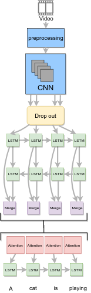

# video-content-description

Increasing trend in the research community for video processing using artificial intelligence.
Trending Tasks:
- Video classification.
- Video content description.
- Video question answering (VQA).

# Main Idea

The main idea is to generate descritptions for unconstrained videos, which can be used in video retrieval, blind navigation, and video subtitling.

# Examples

# Dataset

We use the Microsoft Research Video to Text (MSVD) dataset.
Example of the dataset is shown below.

  

# Extracted Visual Feature
We extracted the visual features of the data set using :

* VGG-16 (like paper): [gdrive link](https://drive.google.com/drive/folders/1su2TCemk04fVmWslx00o-GsuJCBg91YT?usp=sharing)

# Architecture

Here is the our architecture.

  

# Checkpoints

We have trained the model using different techniques.

* Base paper as in seq to seq -- video to text : [gdrive link](https://drive.google.com/drive/folders/1KmBpGfgnm4-zsZbceZQG3R2gMkSMgtb7?usp=sharing)

* Using drop out on features: [gdrive](https://drive.google.com/drive/folders/1Aphqz8JH7WOGS-BU7xqMJ_4baTFiOtzM?usp=sharing)

* Using temporal attention: [gdrive link](https://drive.google.com/drive/folders/1kf1W24PsL636iWZT6kNPoFNqqtGccgvu?usp=sharing)

* Using drop out and attention technique: [gdrive line](https://drive.google.com/drive/folders/1dBczB0wqYeLumdRStyDfUOxK-o-sQ0h1?usp=sharing)

# Results

From the results obtained in the explained experiments,  we found out that the best results obtained are from using attention and drop out. Our model outperforms the original paper model in all used metrics as shown in the following table:

  

# Authors

* [Amr Hendy](https://github.com/AmrHendy)
* [Muhammed Ibrahim](https://github.com/MuhammedKhamis)
* [Abdelrahman Yasser](https://github.com/Abdelrhman-Yasser)
* [Mohammed Shaban](https://github.com/mohamed-shaapan)
* [Arsanuos](https://github.com/Arsanuos)
* [Ahmed Ezzat](https://github.com/AhmedMaghawry) 

# Contribute

Contributions are always welcome!

Please read the [contribution guidelines](contributing.md) first.

# License

This project is licensed under the GNU General Public License v3.0 - see the [LICENSE](LICENSE) file for details
